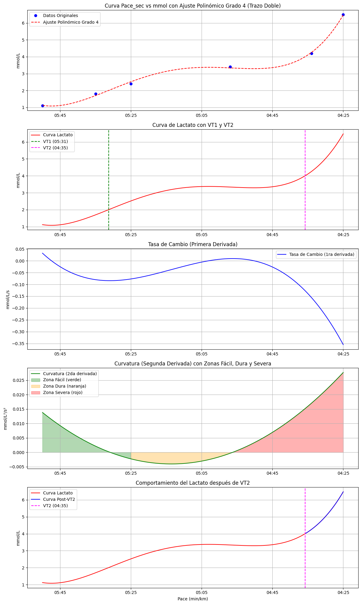

# Análisis de Curvas de Lactato y Umbrales Ventilatorios (VT1 y VT2)

Este proyecto implementa un análisis avanzado de curvas de lactato para un atleta, con el objetivo de identificar los umbrales ventilatorios VT1 y VT2, y evaluar el comportamiento del lactato a través de ajustes matemáticos y técnicas de derivación.

## Descripción

El análisis de lactato es una herramienta clave en el rendimiento deportivo, especialmente en deportes de resistencia como el ciclismo y el running. A través del comportamiento de la concentración de lactato en sangre en función del ritmo (min/km) o potencia (vatios), se puede determinar el nivel de intensidad en el que el cuerpo cambia de predominancia aeróbica a anaeróbica.

Este proyecto:
- Ajusta los datos de lactato utilizando un polinomio de grado 4.
- Calcula los umbrales ventilatorios **VT1** (cercano a 2 mmol/L de lactato) y **VT2** (cercano a 4 mmol/L).
- Evalúa la **tasa de cambio** del lactato a través de la primera derivada.
- Calcula la **curvatura** de la curva de lactato mediante la segunda derivada, dividiendo el esfuerzo en tres zonas:
  - **Zona Fácil** (color verde)
  - **Zona Dura** (color naranja)
  - **Zona Severa** (color rojo)
- Visualiza el **aclaramiento de lactato** después del umbral VT2, donde el lactato se acumula rápidamente y el cuerpo no puede eliminarlo con la misma velocidad.

## Archivos

- `runner1.csv`: Archivo CSV con los datos de ritmo (en segundos por kilómetro) y concentración de lactato (mmol/L).
- `análisis_lactato.py`: Script que realiza el análisis de la curva de lactato y genera visualizaciones de los umbrales, tasa de cambio y curvatura.

## Estructura del CSV

El archivo CSV debe tener la siguiente estructura:

```csv
Pace,mmol,STRYD,Pace (s/km)
05:00,1.8,220,300
04:40,2.0,240,280
04:20,2.3,260,260
04:00,3.1,280,240
03:55,3.6,300,235
03:35,4.2,320,215
03:15,7.2,340,195
03:11,10.5,360,191


